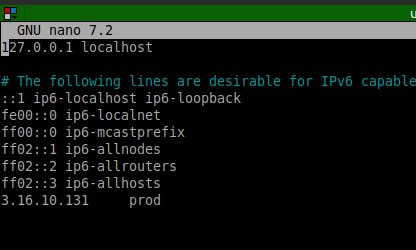

# Diplomado_Cloud_Native

Se crearon las 3 VM con sus pares de llaves y se configuraron los puertos de seguridad para poder acceder a las VM desde el exterior.


## Aplicando Ansible

En el entorno de ejecución de ansible, será aquella máquina que se configura la instalación de ansible así como también el gitlab-runner para el acceso de gitlab. 

Pasando por esta configuración se edita el archivo /etc/host
agregando las máquinas de aws que utilizaremos para agregar:
```bash

IP_MAQUINA [NOMBRE_REFERENCIA]

```


CONFIGURACION SSH

Para la configuración de ssh se debe de generar una llave ssh en la máquina de ansible y copiarla a las máquinas de aws para poder acceder a ellas sin necesidad de contraseña.

### MAQUINA ANSIBLE CONTROLLER
```bash
ssh-keygen -t rsa -b 4096
cd ~/.ssh
cat id_rsa.pub
```

copiamos el contenido de la llave generada y la pegamos en el archivo ~/.ssh/authorized_keys de la maquina PRODUCCION.

### MAQUINA DE PRODUCCION

```bash
sudo adduser ansible
sudo nano /etc/ssh/sshd_config
# Descomentar lo siguiente:
#       PasswordAuthentication yes
#       AuthorizedKeysFile      .ssh/authorized_keys .ssh/authorized_keys2
sudo visudo
# Agregar la siguiente linea en especificaciones de usuario privilegiado:
#       ansible ALL=(ALL) ALL
# --luego...

```

```bash
# si es ubuntu
sudo systemctl restart ssh
# si es alguna vm de GCP o basada en CentOS
sudo systemctl restart sshd

cd ~/.ssh
sudo nano authorized_keys
# Pegar la llave generada en la maquina de ansible
```

```bash
su ansible
mkdir /home/ansible/.ssh
sudo cp /home/ubuntu/.ssh/authorized_keys /home/ansible/.ssh/ # copiamos la llave a la carpeta de ansible

# por ultimo dar los permisos para que ansible pueda acceder a la maquina
sudo chown -R ansible:ansible /home/ansible/.ssh
sudo chmod 700 /home/ansible/.ssh
sudo chmod 600 /home/ansible/.ssh/authorized_keys

```


MAQUINA DE ANSIBLE

```bash
ssh-copy-id ansible@<ip-maquina-produccion>
```

```bash
# INSTALACION DE ANSIBLE
sudo apt update
sudo apt install software-properties-common
sudo add-apt-repository --yes --update ppa:ansible/ansible
sudo apt install ansible
ansible --version
```


PING A MAQUINA DE PRODUCCION

```bash
# Agregar a /etc/hosts la ip de la maquina de produccion
sudo nano /etc/hosts
```


```bash
ping prod
```


## Configuración de ANSIBLE
creamos el playbook y con el comando siguiente lo hacemos correr
```bash
ansible-playbook playBook.yaml
```